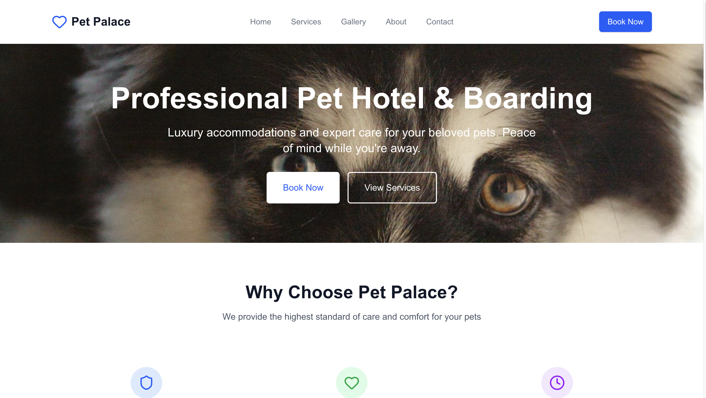
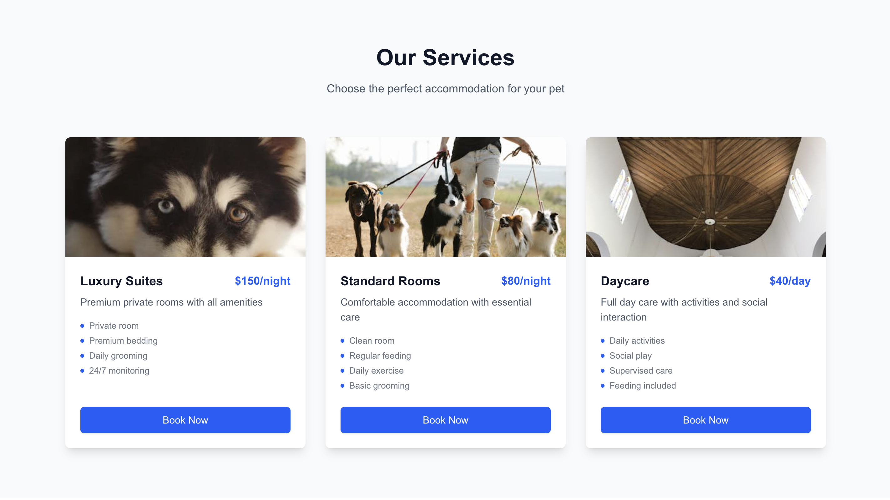
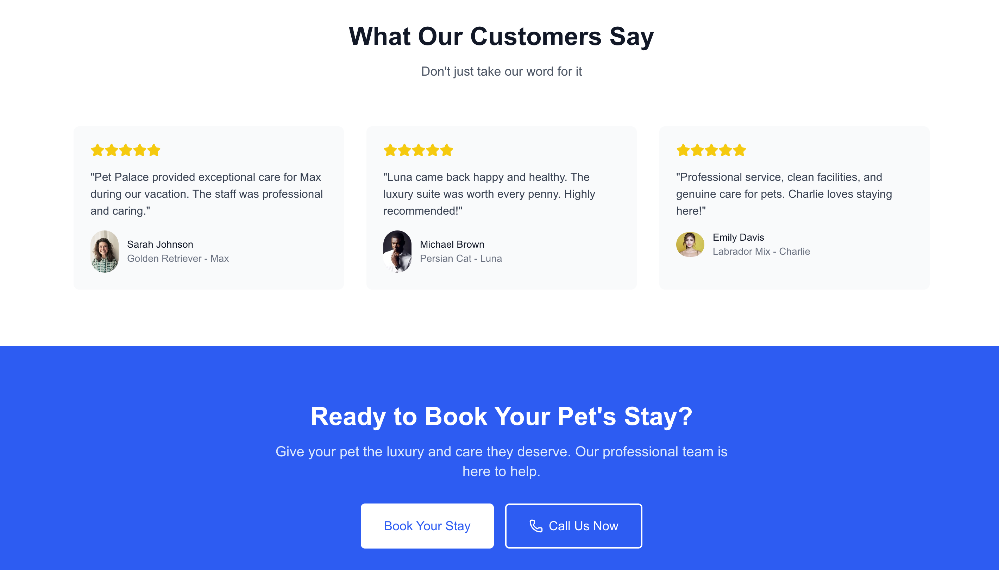
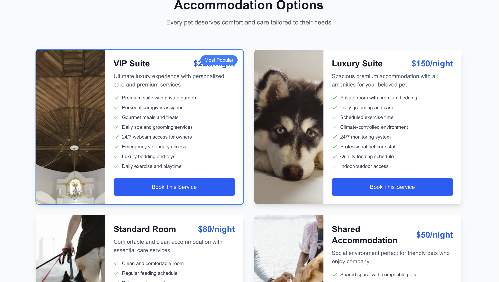
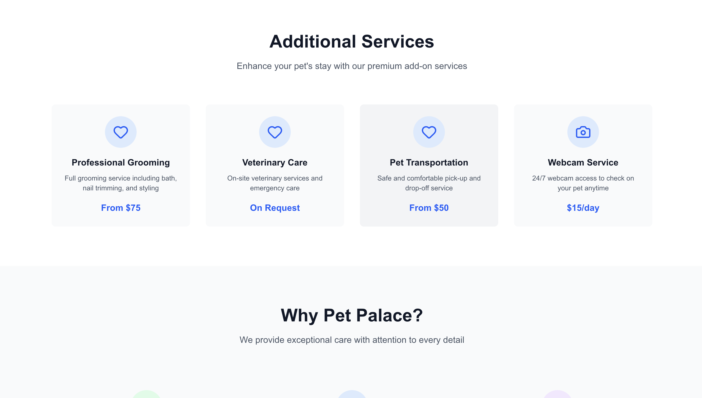
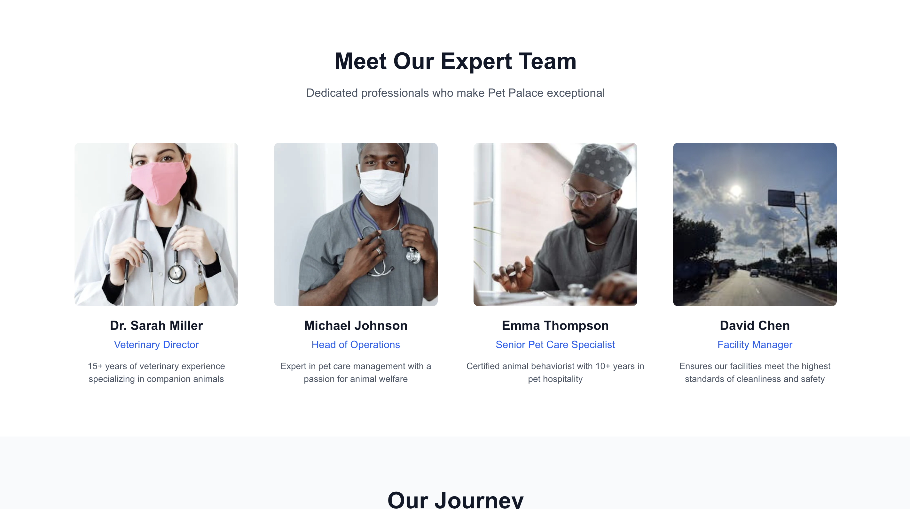
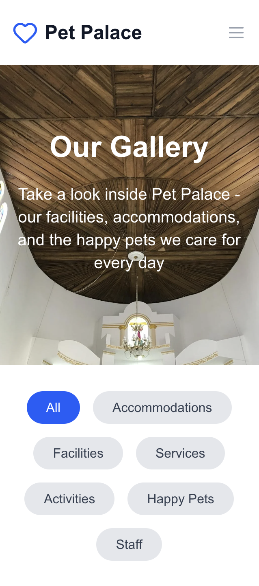
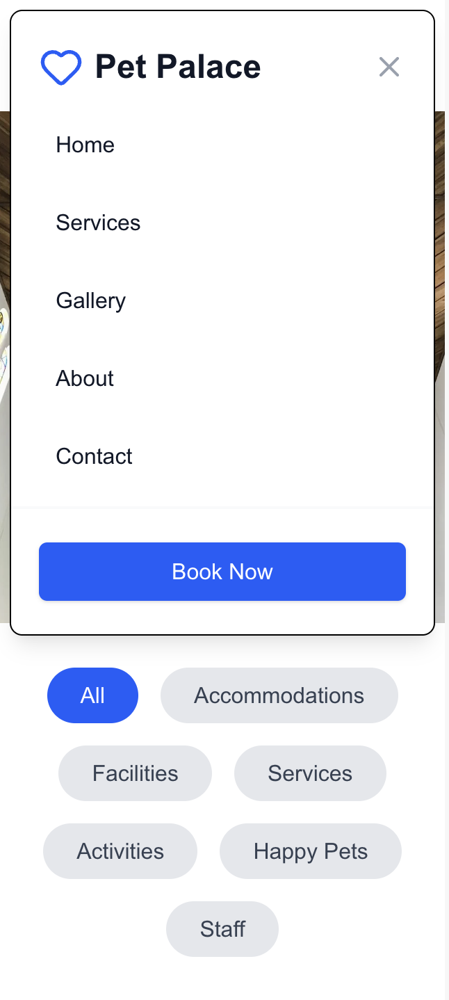
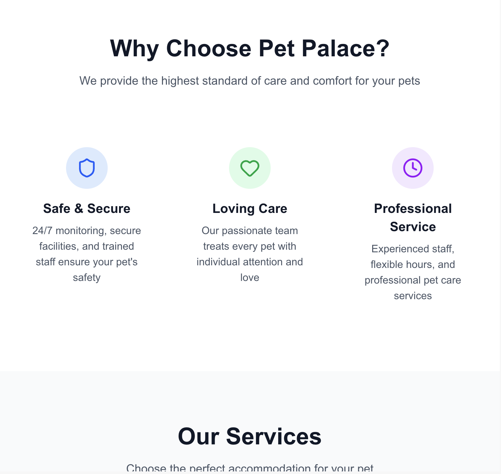
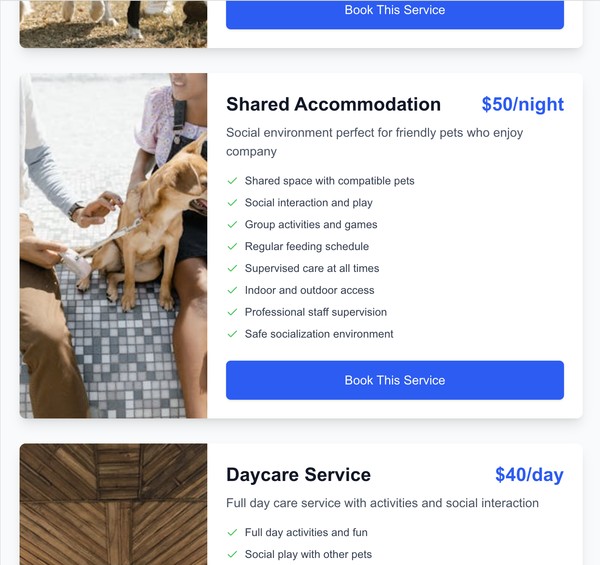

# 🐾 Pet Palace - Professional Pet Hotel & Boarding

[](https://mutlukurt.github.io/pet-palace/)
[](https://nextjs.org/)
[](https://www.typescriptlang.org/)
[](https://tailwindcss.com/)

> **[🚀 VISIT LIVE SITE](https://mutlukurt.github.io/pet-palace/)**

A modern, professional pet hotel and boarding website built with Next.js 15, TypeScript, and Tailwind CSS. This is a complete frontend application showcasing a luxury pet accommodation business with responsive design and professional UI/UX.

---

## 📸 Screenshots

### 🏠 Homepage - Hero Section

*Modern hero section with compelling call-to-action and service overview*

### 💎 Services

*Detailed accommodation options with pricing and premium features*

### 🗣️ What Our Customers Say

*Customer testimonials and reviews showcasing our excellent service*

### 🏨 Accommodations Options

*Comprehensive accommodation packages and luxury amenities*

### 🛎️ Additional Services

*Professional grooming, veterinary care, and premium add-on services*

### 🖼️ Gallery

*Professional photo gallery with category filtering and lightbox*

### 🌟 Gallery Features

*Interactive gallery experience showcasing our facilities and happy pets*


*Complete website functionality and design elements*


*Comprehensive desktop user experience*

### 📱 Mobile Responsive Design

*Mobile homepage with responsive navigation and hero section*


*Mobile-optimized content and user interface*


*Complete mobile experience with touch-friendly design*

### 📊 Tablet Experience

*Tablet-optimized layout and user experience*


*Comprehensive tablet design and functionality*

---

## ✨ Features

### 🎯 Core Functionality
- **Homepage**: Modern hero section with services overview and testimonials
- **Services**: Detailed accommodation options with pricing and features
- **Gallery**: Interactive photo gallery with category filtering and lightbox
- **About**: Company story, team, values, and achievements
- **Contact**: Contact form with business information and FAQ
- **Booking System**: Multi-step booking form with pet details and accommodation selection

### 🎨 Design & UI/UX
- **Responsive Design**: Fully responsive across all device sizes
- **Modern Interface**: Clean, professional design with smooth animations
- **Accessibility**: WCAG compliant design principles
- **Interactive Elements**: Hover effects, transitions, and user feedback
- **Professional Photography**: High-quality Pexels images throughout

### ⚡ Technical Features
- **Next.js 15**: Latest Next.js with App Router
- **TypeScript**: Full type safety
- **Tailwind CSS**: Utility-first CSS framework
- **Mobile-First**: Responsive design approach
- **Performance Optimized**: Image optimization and fast loading
- **SEO Friendly**: Proper meta tags and semantic HTML
- **Static Export**: Optimized for GitHub Pages deployment

---

## 🚀 Live Demo

**[🌐 Visit Pet Palace Website](https://mutlukurt.github.io/pet-palace/)**

Experience the full website with all features:
- Browse luxury pet accommodations
- View professional photo gallery
- Explore company information
- Test the booking system
- Mobile responsive design

---

## 🛠️ Technologies Used

| Category | Technologies |
|----------|-------------|
| **Framework** | Next.js 15 with App Router |
| **Language** | TypeScript |
| **Styling** | Tailwind CSS |
| **Icons** | Lucide React |
| **Images** | Next.js Image component with Pexels |
| **Deployment** | GitHub Pages with GitHub Actions |
| **Development** | ESLint, TypeScript |

---

## 📋 Project Structure

```
src/
├── app/                    # Next.js App Router pages
│   ├── about/             # About page
│   ├── booking/           # Booking system
│   ├── contact/           # Contact page
│   ├── gallery/           # Photo gallery
│   ├── services/          # Services page
│   ├── layout.tsx         # Root layout
│   └── page.tsx          # Homepage
├── components/            # Reusable components
│   ├── layout/           # Header, Footer
│   └── ui/               # UI components
├── lib/                  # Utility functions
├── types/                # TypeScript types
└── data/                 # Static data
```

---

## 🎯 Pages Overview

### 🏠 Homepage (/)
- Hero section with compelling CTA
- Why choose us features
- Services preview cards  
- Customer testimonials
- Call-to-action section

### 💎 Services (/services)
- **VIP Suite**: Ultimate luxury experience ($250/night)
- **Luxury Suite**: Premium accommodations ($150/night)  
- **Standard Room**: Comfortable essential care ($80/night)
- **Shared Accommodation**: Social environment ($50/night)
- **Daycare**: Full day activities ($40/day)
- **Extended Stay**: Discounted longer stays ($120/night)

### 🖼️ Gallery (/gallery)
- Interactive photo gallery
- Category filtering
- Lightbox modal for full-size images
- Facility statistics

### ℹ️ About (/about)
- Company story and mission
- Core values and principles
- Team member profiles
- Company timeline/milestones
- Awards and recognition
- Company statistics

### 📞 Contact (/contact)
- Contact information (phone, email, address)
- Interactive contact form
- Business hours
- Emergency contact info
- FAQ section
- Map placeholder

### 📅 Booking (/booking)
- Multi-step booking process
- Pet information form
- Accommodation selection with dates
- Owner contact details
- Booking summary and confirmation
- Price calculation

---

## 🎨 Design System

### 🌈 Color Palette
- **Primary**: Blue-600 (#2563eb) - Trust and reliability
- **Secondary**: Purple-700 (#7c3aed) - Premium feeling
- **Success**: Green-600 (#16a34a) - Positive actions
- **Warning**: Yellow-500 (#eab308) - Important notices
- **Error**: Red-600 (#dc2626) - Error states

### 📱 Responsive Breakpoints
- **Mobile**: < 640px
- **Tablet**: 640px - 1024px  
- **Desktop**: 1024px+
- **Large Desktop**: 1280px+

---

## 🚀 Getting Started

### Prerequisites
- Node.js 18+ 
- npm, yarn, or pnpm

### Installation

1. **Clone the repository:**
```bash
git clone https://github.com/mutlukurt/pet-palace.git
cd pet-palace
```

2. **Install dependencies:**
```bash
npm install
# or
yarn install
# or
pnpm install
```

3. **Start the development server:**
```bash
npm run dev
# or
yarn dev
# or
pnpm dev
```

4. **Open [http://localhost:3000](http://localhost:3000)** in your browser

### 🔧 Available Scripts

```bash
# Development
npm run dev          # Start development server
npm run build        # Build for production
npm run start        # Start production server
npm run lint         # Run ESLint

# Development with Turbopack (faster)
npm run dev --turbo
```

---

## 🌐 Deployment

The project is deployed on **GitHub Pages** with automated deployment via **GitHub Actions**.

### 📦 Deployment Process
1. **Automatic**: Push to `main` branch triggers deployment
2. **Build**: Next.js static export with optimizations
3. **Deploy**: GitHub Actions deploys to GitHub Pages
4. **Live**: Site available at https://mutlukurt.github.io/pet-palace/

### 🔄 Manual Deployment
```bash
npm run build      # Build static files
# Files are exported to ./out directory
```

---

## 💼 Business Features

### 🎯 Target Audience
- Pet owners who travel for business/vacation
- Professional working couples
- Families seeking premium pet care
- Pet owners wanting luxury accommodations

### 🏨 Service Categories
- **VIP Suite**: Ultimate luxury experience ($250/night)
- **Luxury Suite**: Premium accommodations ($150/night)  
- **Standard Room**: Comfortable essential care ($80/night)
- **Shared Accommodation**: Social environment ($50/night)
- **Daycare**: Full day activities ($40/day)
- **Extended Stay**: Discounted longer stays ($120/night)

### 🛎️ Additional Services
- Professional grooming
- Veterinary care
- Pet transportation
- 24/7 webcam access
- Special diet plans
- Extra playtime

---

## 🔮 Future Enhancements

- [ ] Backend integration with database
- [ ] User authentication system
- [ ] Online payment processing
- [ ] Real-time availability calendar
- [ ] Email notifications
- [ ] Admin dashboard
- [ ] Review system integration
- [ ] Multi-language support
- [ ] PWA capabilities

---

## 📞 Contact Information

**Pet Palace**
- 📞 Phone: +1 (555) 123-4567
- 📧 Email: info@petpalace.com
- 📍 Address: 123 Pet Palace Drive, Beverly Hills, CA 90210, United States
- 🕒 Hours: Mon-Fri 7AM-8PM, Sat-Sun 8AM-6PM
- 🚨 Emergency: +1 (555) 911-PETS (7387)

---

## 📄 License

This project is created for demonstration purposes. All images are from Pexels and are free to use.

---

## 🤝 Contributing

1. Fork the project
2. Create your feature branch (`git checkout -b feature/AmazingFeature`)
3. Commit your changes (`git commit -m 'Add some AmazingFeature'`)
4. Push to the branch (`git push origin feature/AmazingFeature`)
5. Open a Pull Request

---

## ⭐ Show Your Support

Give a ⭐️ if this project helped you!

**[🌐 Visit Live Site](https://mutlukurt.github.io/pet-palace/)**

---

**Built with ❤️ for pet lovers everywhere**

*Professional pet care website showcasing modern web development with Next.js, TypeScript, and Tailwind CSS*